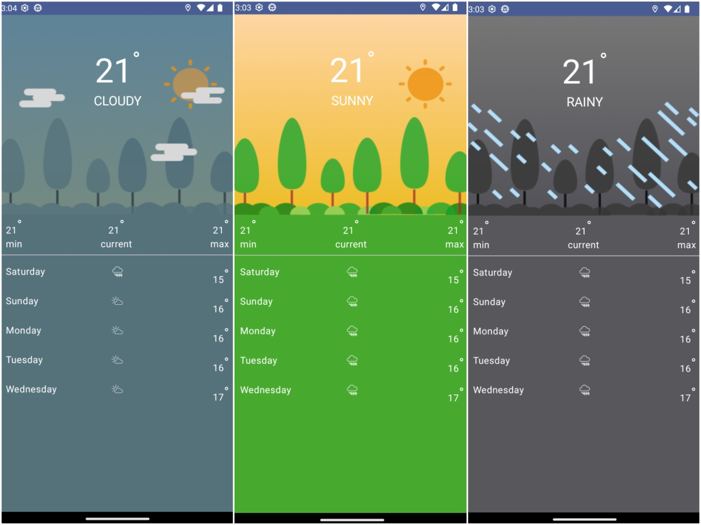

# Weathernow

A weather android app that displays weather from [Open weather](https://openweathermap.org/) .

## Getting Started

### System requirement
1. [Android studio](https://developer.android.com/studio) as the IDE
1. The latest version of [Java](https://www.oracle.com/java/technologies/downloads/)
1. An android [emulator](https://developer.android.com/studio/run/managing-avds) or a physical android device

> See this [tutorial](https://youtu.be/0zx_eFyHRU0)

### Local set up
1. You just need to [clone](https://docs.github.com/en/repositories/creating-and-managing-repositories/cloning-a-repository) this project
1. Launch android studio, select `open` and select the root folder `bongo-android`.
1. [Build and run](https://developer.android.com/studio/run) the app

## libraries used

* [Retrofit](http://square.github.io/retrofit/)
* [OkHttp](http://square.github.io/okhttp/)
* [Mockk](https://github.com/mockk/mockk/)
* [Turbine](https://github.com/cashapp/turbine/)
* [KotlinxSerializationJson](hhttps://kotlinlang.org/docs/serialization.html)
* [Hilt](https://developer.android.com/training/dependency-injection/hilt-android)

## Architecture
This app is built with the Clean Architecture. Its broken down to features which contain the
following layers: 
### Presentation
* User Interface built with [Jetpack Compose](https://developer.android.com/jetpack/compose)
* A single-activity architecture
* Each feature contains a Compose screen **View** and a **ViewModel** per screen (or
  feature).
* Reactive UIs using **Flow** and **Coroutines** for asynchronous operations.
### Screenshot

### Domain
The Domain Layer has three primary purposes:
* Abstraction of the Data Layer of the application
* Providing a common set of Models
* Providing a High-Level description of the applications primary functions based on problem domain analysis

### Data
The Data Layer contains implementations of the data sources which are described in the repository package of the domain layer.

